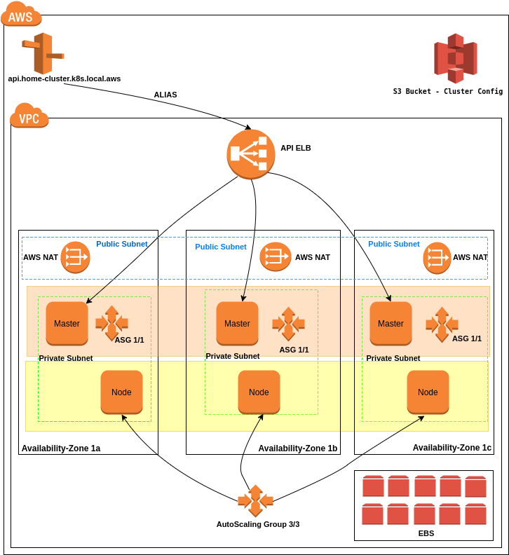

Kubernetes on AWS
==================


In this repository we will see step by step how to setup Kubernetes Cluster on AWS using KOPS.  
KOPS will handle all operations on AWS, we only need to specify some arguments.  
Some days ago, at the AWS re:Invent dec. 2017, AWS introduced EKS, a full managed Kubernetes on AWS.  
So, why using KOPS ? Because EKS is not released yet :)  
But, we won't let KOPS handle all the stuff for us. We will output everything as Terraform code.  
The latter, will help us to get full control on our Infrastructure, like using remote-state to reuse resources with another Infrastructure, to add more security groups....etc  

**Prerequisite :**

Install KOPS
```
curl -LO https://github.com/kubernetes/kops/releases/download/$(curl -s https://api.github.com/repos/kubernetes/kops/releases/latest | grep tag_name | cut -d '"' -f 4)/kops-linux-amd64
chmod +x kops-linux-amd64
sudo mv kops-linux-amd64 /usr/local/bin/kops
```

Install Kubectl
```
curl -LO https://storage.googleapis.com/kubernetes-release/release/$(curl -s https://storage.googleapis.com/kubernetes-release/release/stable.txt)/bin/linux/amd64/kubectl
chmod +x ./kubectl
sudo mv ./kubectl /usr/local/bin/kubectl
```

Install Terraform

check here: https://www.terraform.io/downloads.html  


Install AWS-cli (make sure to get pip installed)  

```pip install awscli --upgrade --user```  

Configure your AWS Access: 
 
Add the following file  
```
vi ~/.aws/credentials
[default]
aws_access_key_id = XXXXXXX
aws_secret_access_key = XXXXXXXX
```


**First step :**

In your AWS Console, make sure to have:

> A bucket where KOPS will store its state and config  
> A private hosted-zone in Route 53 which must have the same name as your Kubernetes Cluster


**Second step :**

We will use KOPS to create the cluster using following parameters:  


```
kops create cluster "home-cluster.k8s.local.aws" \
     --state="s3://home-cluster.k8s.local.aws" \
     --admin-access="YOUR_PUBLIC_IP" \
     --master-size="t2.micro" \
     --master-zones="eu-west-1a,eu-west-1b,eu-west-1c" \
     --node-size="t2.micro" \
     --zones="eu-west-1a,eu-west-1b,eu-west-1c" \
     --node-count="3" \
     --dns=private \
     --topology=private \
     --networking=weave \
     --ssh-public-key "home.cluster.kubernetes.pub" \
     --out=terraform \
     --target=terraform \
     --kubernetes-version="1.8.4" \
     --bastion=false
```


> Please note that I am using T2 instance only for a personal use, don't use it in your production.  
> I am also not using bastion because of personal use, you should use it in your production environment.  
> I noticed to that SSH Keys generated by AWS are not supported by KOPS so I generated my own Key pair using ```ssh-keygen```  

This will create a terraform file with all necessary resources.  

**Third step :**  

Now We need to apply our terraform config.  

```terraform apply```

This will setup the following fault-tolerant and high-available infrastructure  



And of course all needed security groups, roles, subnets, volumes...etc.  

As we are using private DNS we need to get the IP of the ELB and add it to the /etc/hosts file to match it with the api cluster address created by terraform.  
We need to do that as Kubectl is using the DNS to communicate with the cluster.
Don't use that method on your production of course, use your own public domain.  
 

We can now validate our cluster using the following command  

```kops validate cluster home-cluster.k8s.local.aws --state="s3://home-cluster.k8s.local.aws"```  
                                                                             
```Validating cluster home-cluster.k8s.local.aws

INSTANCE GROUPS
NAME                    ROLE    MACHINETYPE     MIN     MAX     SUBNETS
master-eu-west-1a       Master  t2.micro        1       1       eu-west-1a
master-eu-west-1b       Master  t2.micro        1       1       eu-west-1b
master-eu-west-1c       Master  t2.micro        1       1       eu-west-1c
nodes                   Node    t2.micro        3       3       eu-west-1a,eu-west-1b,eu-west-1c

NODE STATUS
NAME                                            ROLE    READY
ip-172-20-108-28.eu-west-1.compute.internal     node    True
ip-172-20-127-49.eu-west-1.compute.internal     master  True
ip-172-20-40-178.eu-west-1.compute.internal     node    True
ip-172-20-56-65.eu-west-1.compute.internal      master  True
ip-172-20-69-224.eu-west-1.compute.internal     node    True
ip-172-20-76-177.eu-west-1.compute.internal     master  True

Your cluster home-cluster.k8s.local.aws is ready
```

Our infrastructure is now ready.  
We can start working on it using ```kubectl``` to deploy our apps.  
Make sure that the following command is listing your cluster nodes.

```
kubetclt get node  


NAME                                          STATUS    ROLES     AGE       VERSION
ip-172-20-108-28.eu-west-1.compute.internal   Ready     node      2m        v1.8.4
ip-172-20-127-49.eu-west-1.compute.internal   Ready     master    3m        v1.8.4
ip-172-20-40-178.eu-west-1.compute.internal   Ready     node      1m        v1.8.4
ip-172-20-56-65.eu-west-1.compute.internal    Ready     master    3m        v1.8.4
ip-172-20-69-224.eu-west-1.compute.internal   Ready     node      2m        v1.8.4
ip-172-20-76-177.eu-west-1.compute.internal   Ready     master    3m        v1.8.4
```

Here we go, our Kubernetes Cluster is ready for use.  
In other repositories, I'll show you how we can create some microservices running on the Kubernetes Cluster.  
  